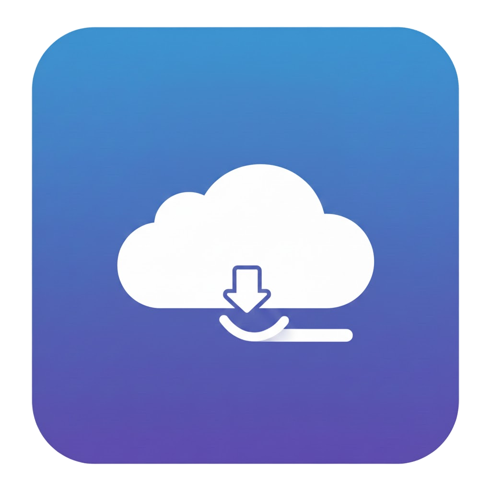

<p align="center">
  
</p>
<h1 align="center">YouTube Download WebUI</h1>

<p align="center">
A YouTube video and audio download web interface based on FastAPI + React.
</p>

<div align="center">


[](../LICENSE) <br>
[](../README.md) 
[](README_simp_chinese.md)

</div>

## ✨ Features

- **Video Download**: Supports downloading YouTube videos.
- **Audio Download**: Can extract and download audio separately.
- **Modern Interface**: Clean and intuitive web operation experience.
- **Dual Media Download Core**: Uses **yt-dlp + pytubefix**. When yt-dlp fails, it automatically switches to pytubefix for a stable download experience.
- **Docker Support**: Provides Docker images for easy deployment.
- **Auto-open**: Automatically opens the browser when the program starts (effective in non-Docker environments).

## 🚀 Quick Start

<details>
    <summary>🔧 Deployment in non-Docker environment</summary>

### Prerequisites
- Python 3.14 (Compatibility with lower or higher versions has not been tested yet)
- Node.js (For building the frontend)
- [uv](https://github.com/astral-sh/uv)

### 1. Install and Build Frontend

Enter the frontend directory and install dependencies:

```bash
cd front
npm install
```

Build production environment files:

```bash
npm run build
```

### 2. Setup Backend Environment

Return to the project root directory, use `uv` to sync the environment and install dependencies:

```bash
cd ..
uv sync
```

### 3. Start the Application

Execute the main program:

```bash
uv run main.py
```

After the program starts, the browser should automatically open `http://localhost:8127`

</details>

<details>
    <summary>🐳 Deployment using Docker</summary>

- **After cloning the project, if data and logs folders are missing, please create them manually.**
- Use the following command in the terminal:
    ```bash
    docker-compose up -d --build
    ```

</details>

## ⚠️ Disclaimer
This project is for **educational purposes only**. Please do not use it for commercial purposes or expose it on public networks.
The developers of this project are not legally responsible for any illegal acts committed by users.

## 📄 License
[Apache License 2.0](../LICENSE)
